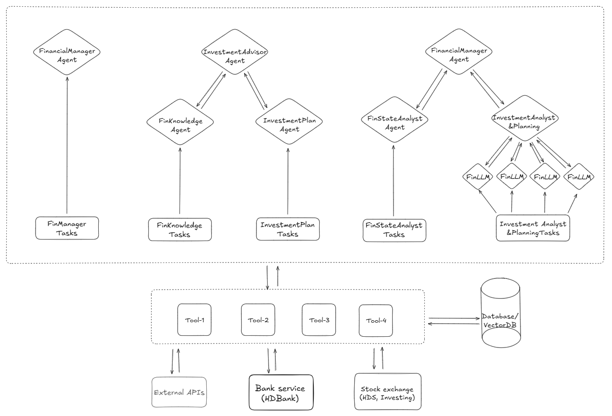

# 💰 AI Financial Agents

## 1. 📌 Project Overview

This project is an **AI-powered financial advisory chatbot**, designed to be integrated into popular banking apps or messaging platforms.  
A dedicated **web interface** is planned for advanced financial analytics in the near future.

## 2. ✨ Key Features

- 🧾 **Personal finance management**: Tailored budgeting and financial planning based on user goals and risk tolerance.
- 📚 **Learn & invest for beginners**: Clear explanations of financial concepts, investment basics, and potential risk scenarios. Introduces safe, beginner-friendly investment options (e.g., mutual fund certificates) to help users get started.
- 📊 **Advanced market analysis**: In-depth insights including financial statement analysis, market trend evaluation, and trade decision support. Uses specialized agents to simulate the investment styles of renowned investors (e.g., Warren Buffett, Charlie Munger, Ben Graham, Phil Fisher) to broaden perspectives for informed decision-making.

### 🔄 System Flow

Here’s the overall system flow:

## 3. 🚀 Progress During Hackathon

- ✅ **Done**: Built messaging service connected to Telegram bot.
- ✅ **Done**: Built a detailed financial planning agent that optimally divides the budget based on user information and needs.
- 🔄 **In Process**: Deployment of version 1 for end-users.
- 🔄 **In Process**: Building a planning agent to help users acquire knowledge about finance and investment. Provides guidance on market analysis and choosing the right type of investment.
- 🔮 **Future**: Agents that update daily with new information on economic, financial, political, and policy topics that affect the market through reputable platforms.
- 🔮 **Future**: Agents that perform in-depth analysis of financial reports and market trends.
- 🔮 **Future**: Agents powered by FinLLMs that simulate the styles of famous investors to evaluate markets and stock codes, supporting investment decisions.

🎯 **Target date** to trial the Personal Finance Management experience via Telegram bot: [t.me/fin_mn_agent_bot](https://t.me/fin_mn_agent_bot) — **2025-09-23**.

## 4. 🤝 Contributions

Contributions are welcome! Please contact the team to discuss ideas and proposals.
